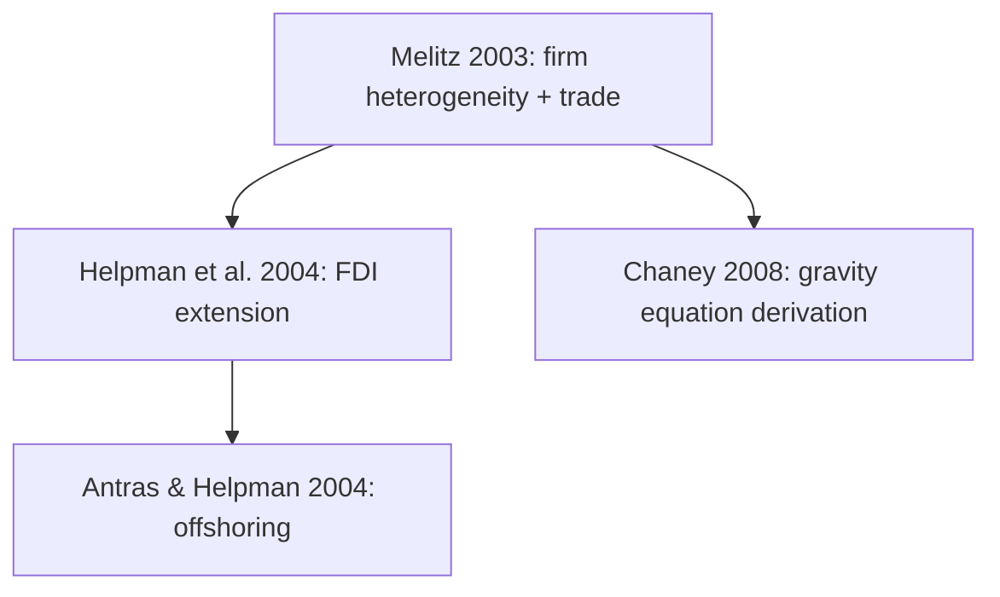

# epr-survey — Reading Economics Survey Articles

Survey papers are maps, not destinations. The reader's goal is not to evaluate a single
argument but to quickly understand how a field developed, where it stands, and where to
go next. Reading strategy is accordingly different from empirical or theory papers.

## When to load this subskill

- Paper title contains: "survey", "review", "handbook", "overview", "perspectives", "frontiers"
- No primary data, identification strategy, or structural model of its own
- Main contribution is synthesis, taxonomy, or mapping of a literature

If the paper is primarily a new model or new estimates with a long literature review section,
use `epr-theory` or `epr-empirical` instead — this subskill is for papers where synthesis
**is** the contribution.

---

## Mandatory output block for survey papers

The report for a survey paper replaces the standard 研究设计 / 实证设计 / 模型设定 sections
with the following dedicated block. Place it immediately after 政策与背景 (if applicable).

```
### 文献框架 (Literature Map)

**领域发展脉络 (Field Development)**

[Describe how the field evolved chronologically. Identify the distinct phases or waves
of research. For each phase: what question was being asked, what methods were used,
what was the dominant finding or consensus.

Format as a narrative timeline, e.g.:
- 第一阶段（1970s–1990s）：...
- 第二阶段（2000s）：...
- 第三阶段（2010s至今）：...]

**文献逻辑图 (Literature Logic Map)**

[Produce a plain-text diagram showing how the key contributions relate to each other.
Use ASCII art or Mermaid syntax. Show: foundational papers → derivatives / responses /
extensions → current frontier. Show debate structure if papers are in direct dialogue.

Example Mermaid format:

]

**基准文献 (Benchmark Papers)**

| 文献 | 核心贡献 | 在领域中的地位 |
|------|---------|--------------|
| Author (Year) | [what it established] | [foundational / watershed / most-cited / method-defining] |

[List ALL papers the survey itself identifies as foundational, watershed, or seminal.
Include papers that the survey repeatedly returns to as points of reference.
Do NOT limit this list — include every benchmark the survey cites as such.]

**主要争议与未解问题 (Open Questions & Debates)**

[What are the unresolved debates the survey identifies?
What does the survey say the frontier is?
What methods or data does the survey say the field needs?]
```

---

## 延伸阅读 rule for survey papers

**Override the default 3-reference limit**: For survey papers, the 延伸阅读 section should
include ALL benchmark papers identified in the 基准文献 table above, plus any other
papers the survey itself marks as essential reading. There is no upper cap.

Format every reference per `epr-related-refs` rules (ref-format). Sort Chinese references
first, then English references, alphabetically within each group. Number continuously.

---

## Reading strategy for survey papers

1. **Read the introduction and conclusion first** — surveys usually state their organizational
   logic explicitly. The author tells you how they carved up the literature.

2. **Identify the taxonomy** — How does the survey classify the literature? By method?
   By question? By time period? This taxonomy is the survey's intellectual contribution.

3. **Mark the benchmark papers** — Every survey has 3–8 papers it keeps returning to.
   These are the benchmark papers. Note them immediately.

4. **Track the "open questions" section** — Usually near the end. This is where the
   frontiers are. For a researcher new to the field, this is the most valuable part.

5. **Don't try to absorb every citation** — A survey may cite 200+ papers. Focus on
   the ones discussed in depth (multiple paragraphs) vs. those mentioned in passing.
